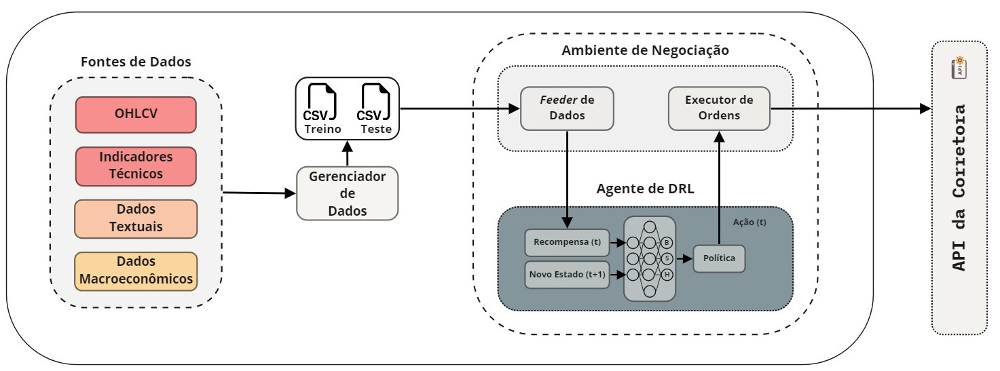

# Mestrado PPGI (UnB) - Aplicação do Aprendizado por Reforço Profundo na Negociação por Algoritmos no Mercado Financeiro Brasileiro

Repositório destinado ao armazenamento dos códigos implementados durante o mestrado realizado no PPGI (UnB). 
Iniciado em 20/04/2022.

---

## Resumo da Proposta

O uso de algoritmos para a negociação de ativos nas bolsas de valores ganhou destaque com o avanço da capacidade computacional nos últimos anos. A grande quantidade de dados financeiros disponíveis incentivou a criação de diferentes estratégias quantitativas de investimento. Dentre as propostas no domínio da inteligência artificial, o uso do Aprendizado por Reforço Profundo (DRL), que um dos paradigmas de aprendizado aplicado a problemas que envolvem sequências de decisões em cenários complexos ganhou destaque, sendo este utilizado para a criação de agentes inteligentes e para a simulação dos ambientes de negociação. Dando importância ao exposto, o presente trabalho propõe o AARON: um serviço de negociação individualizada de ativos que utiliza um agente de DRL e combina múltiplas modalidades de dados do mercado financeiro para a tomada informada de decisão. Para tanto, o AARON combina os dados históricos de cotações, indicadores técnicos, dados acerca da polaridade de sentimentos extraídos de textos provenientes de portais de notícias e do Twitter e dados macroeconômicos. A proposta foi avaliada em diferentes etapas, a partir de combinações entre a quantidade de dados utilizados e o esquema de recompensa adotado pelo agente de DRL do AARON. Os resultados mostraram que a estratégia desenvolvida superou o patrimônio líquido inicial investido em 91\% dos casos para as ações da PETR4, sendo esta a melhor média entre os cenários de avaliação explorados. Além disso, todos os cenários consideram a simulação de taxas de transação cobradas pelas instituições financeiras.

### Organização da Proposta

A visão geral dos componentes utilizados para desenvolver o AARON é ilustrada na Figura acima. O modelo contextual proposto é formado por três módulos: (i) **Fontes de Dados:** módulo responsável por fornecer ao módulo Ambiente de Negociação os dados de mercado (e.g. cotações e indicadores técnicos) e dados alternativos (e.g. texto de notícias e publicações em redes sociais) que serão utilizados para a criação do modelo contextual de negociação a partir do treinamento do módulo Agente de DRL; (ii) **Ambiente de Negociação:** módulo responsável por organizar os diferentes tipos de dados recebidos, realizar transformações e fornecer as informações necessárias ao módulo Agente de DRL (e.g. quantidade monetária disponível em carteira, quantidade de papéis adquiridos, conjunto atual dos dados selecionados); e (iii) **Agente de DRL:** algoritmo de DRL modelado para a negociação individualizada de ativos do mercado financeiro a partir da combinação de dados estruturados e não-estruturados.

---

